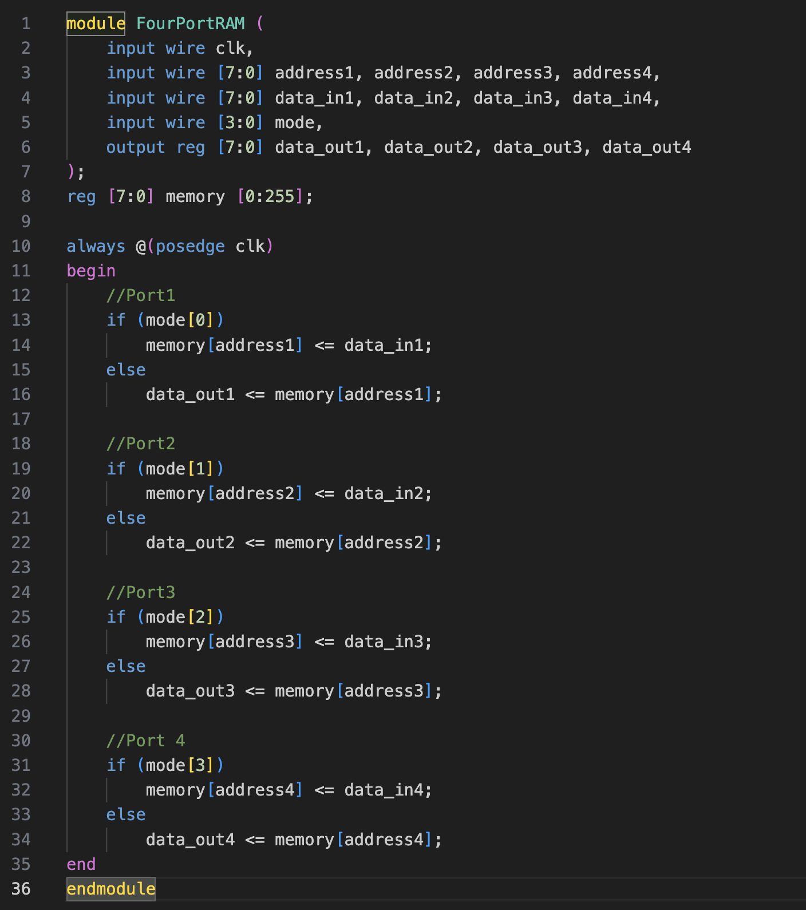
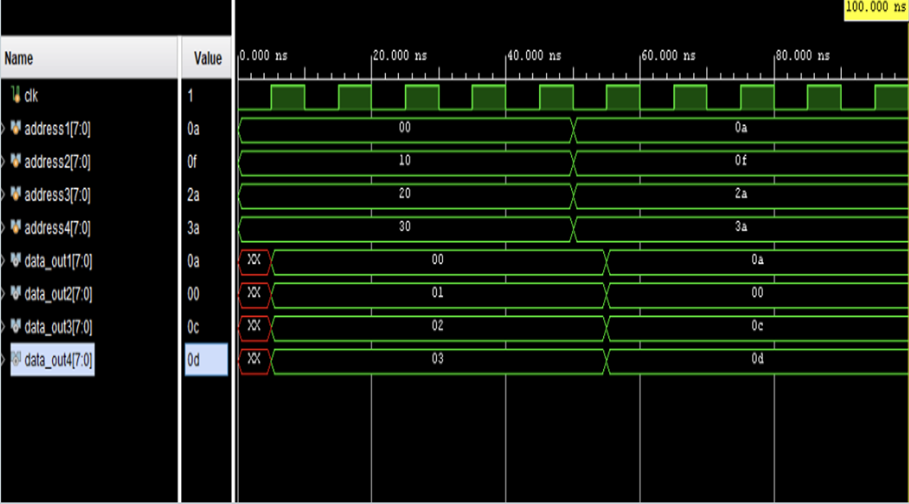
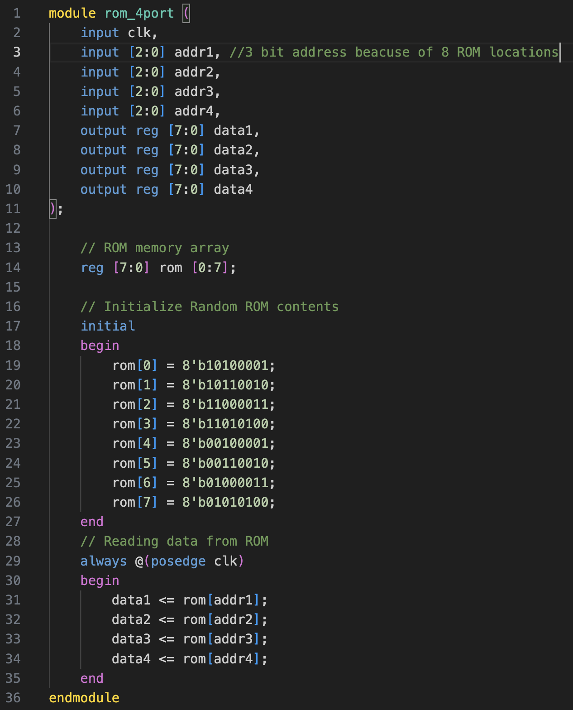
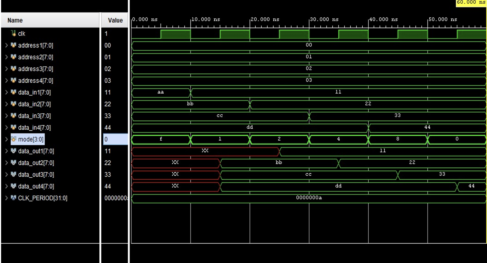

# 4 port RAM and RAM

I developed a functional RAM (Random Access Memory) and ROM (Read Only Memory) with the ability to handle four simultaneous accesses in Verilog RTL Language in Xilinix Vivado EDA software .

## 4-Port RAM
A 4-port RAM (Random Access Memory) allows simultaneous read and write operations from four different sources or processors.
Useful in applications where multiple processors or cores need to access and modify data independently such as in multi-core processors.

### Verilog design 

### Simulation

## 4-Port ROM
A 4-port ROM (Read-Only Memory) allows simultaneous access to stored data from four different sources or processors. Unlike RAM, ROM is read-only.
Used for applications requiring multiple devices to access constant data or firmware with multiple processors.

### Verilog design 

### Simulation

